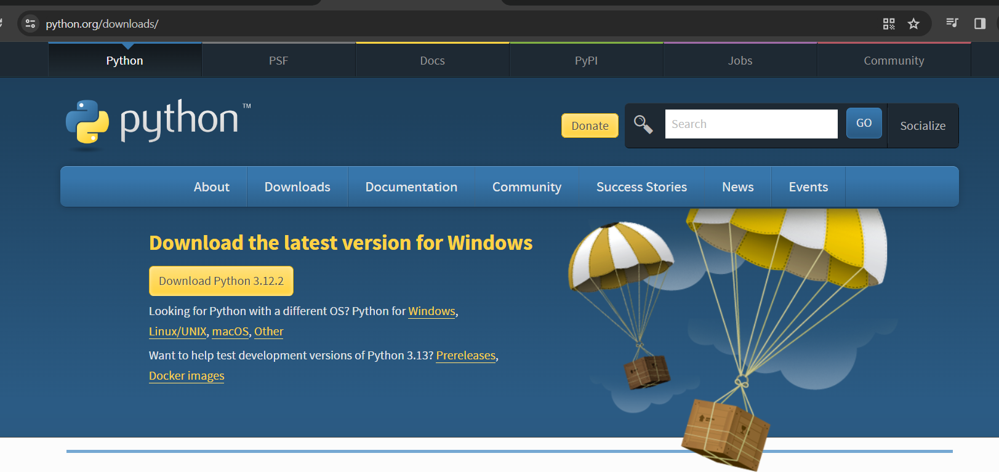

# Installation and Setup

https://www.youtube.com/watch?v=YYXdXT2l-Gg&list=PL-osiE80TeTt2d9bfVyTiXJA-UTHn6WwU

## Check Python version in your terminal

```bash
python --version
```

## Download Python (Windows, Mac)

https://www.python.org/downloads/

- [Install on Windows](#windows)
- [Install on Mac](#mac)



### Windows

Check the `Add Python x.x to PATH` checkbox.

### Mac

A note after download in **MacOS**, it may still show a lower version of Python if your mac is pre-installed with it. You may then try to run the following command:

```bash
python3 --version
```

You can go to `~/.bash_profile` and create an `alias` for `Python 3` or the latest version that you downloaded

```text
alias python=python3
```

### Hello World

`hello.py`

```py
print('Hello World')
```

Run command in your terminal:

```bash
python hello.py
```
