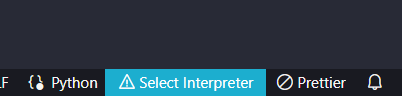
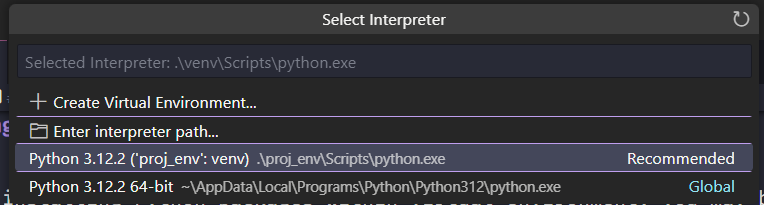
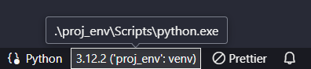

# virtualenv

Includes learning `pip`:

- a package manager for Python packages that comes along during `Python installation`
- similar to `npm` for `NodeJs`

Virtual Environments in Python allows us to keep project-specific dependencies in a separate place than our global packages.

This is useful when you have different versions of packages for different packages.

Reference: https://www.youtube.com/watch?v=N5vscPTWKOk&list=PL-osiE80TeTt2d9bfVyTiXJA-UTHn6WwU

## virtualenv topics

- [virtualenv installation](#installation)
- [Getting Started](#getting-started)
  - [Create virtual environment](#create-a-virtual-environment)
  - [Activating virtual environment](#activating-the-virtual-environment)
  - [Deactivating virtual environment](#deactivating-virtual-environment)
  - [Specific Python version for virtual environment](#specifying-python-version-on-virtual-environment)
- [Running Python inside virtual environment](#running-python-packages-within-virtualenv)
- [VSCode Select Interpreter](#vscode-select-interpreter)
- [Manually Select Interpreter](#manually-specify-python-interpreter)

## pip topics

- [virtualenv installation](#installation)
- **Getting Started**
  - [Install Python packages](#install-python-packages)
  - [List packages installed](#list-the-packages-installed)
  - [pip freeze for requirements.txt](#pip-freeze-for-requirementstxt)
  - [Share your dependencies](#share-dependencies)

## Installation

Check if you have `virtualenv` already installed using the following command in your terminal:

```bash
pip list
```

If not installed, then run the command:

```bash
pip install virtualenv
```

**Output**

```bash
Collecting virtualenv
  Downloading virtualenv-20.25.0-py3-none-any.whl.metadata (4.5 kB)
Collecting distlib<1,>=0.3.7 (from virtualenv)
  Downloading distlib-0.3.8-py2.py3-none-any.whl.metadata (5.1 kB)
Collecting filelock<4,>=3.12.2 (from virtualenv)
  Downloading filelock-3.13.1-py3-none-any.whl.metadata (2.8 kB)
Collecting platformdirs<5,>=3.9.1 (from virtualenv)
  Downloading platformdirs-4.2.0-py3-none-any.whl.metadata (11 kB)
Downloading virtualenv-20.25.0-py3-none-any.whl (3.8 MB)
   ━━━━━━━━━━━━━━━━━━━━━━━━━━━━━━━━━━━━━━━━ 3.8/3.8 MB 4.4 MB/s eta 0:00:00
```

Running the command `pip list` again to see it installed:

```bash
Package      Version
------------ -------
distlib      0.3.8
filelock     3.13.1
pip          24.0
platformdirs 4.2.0
virtualenv   20.25.0
```

# Getting Started

## Create your project directory

Create a **folder** with any name you want (e.g. `proj-name`)

```bash
mkdir proj-name
cd proj-name
```

In this case, we are already within our project folder `learn-python`

## Create a Virtual Environment

```bash
virtualenv env_name
```

Creates a folder in current directory

## Activating the virtual environment

### Linux or Mac

```bash
source env_name/bin/activate
```

### Windows

```bash
.\env_name\Scripts\activate
```

Notice that it will now always prepend the `(env_name)` in your terminal.

**Test running python**

### Linux or Mac

```bash
which python
which pip
```

### Windows

```bash
where python
where pip
```

Notice that it will also include the virtual environment path for the python.exe

## Install Python packages

```bash
pip install numpy
pip install pytz
pip install psutil
```

## List the packages installed

```bash
pip list
```

**Output**

```bash
Package Version
------- -------
numpy   1.26.4
pip     23.3.1
psutil  5.9.8
pytz    2024.1
```

Notice that it will only install and list packages in the **virtual environment**.

Location of installed packages: `env_name/Lib/site-packages`

## pip freeze for requirements.txt

```bash
pip freeze --local > requirements.txt
```

It will create a `requirements.txt` with following content:

```txt
numpy==1.26.4
psutil==5.9.8
pytz==2024.1
```

The `--local` flag takes only the local dependencies and excluding global dependencies.

## Share Dependencies

You can give the `requirements.txt` to other people and have them installed:

```bash
pip install -r requirements.txt
```

## Deactivating Virtual Environment

Simply run this command in terminal:

```bash
deactivate
```

Then you can now freely **delete** your virtual environment

## Specifying Python version on virtual environment

```bash
virtualenv -p <path_to_specific_python_exe_version> env_name
```

# Running Python packages within virtualenv

```bash
# After virtual environment is activated
python main.py
```

After installing Python packages within virtual environment, you may bumped into an error that the modules are not found.

In this case, just remember that you must use the `Python` inside the `virtual environement` as the "Python interpreter" and not the global Python.

# vscode select interpreter

Vscode has an extension for `Python` (by `Microsoft`) that includes `Pylance` and `Python Debugger` extensions that will help you configure your Python interpreter.

## Current interpreter can be seen on the bottom right corner



## Then select your virtual environment with the name `env_name`



## Verify that you are now using the Python within the virtual environment



> **Note**: `proj_env` is the virtual environment name that was generated using `virtualenv proj_env`

After selecting the interpreter, verify that the dependencies are installed.

```bash
pip install -r requirements.txt
```

# Manually Specify Python Interpreter

```bash
# After virtual environment is activated
python main.py
```

You can also specify the Python path in your virtual environment like so:

### Linux or Mac

```bash
source env_name/bin/python main.py
```

### Windows

```bash
.\env_name\Scripts\Python main.py
```
