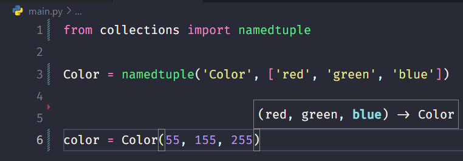

# Learn Named Tuple

https://www.youtube.com/watch?v=GfxJYp9_nJA&list=PL-osiE80TeTt2d9bfVyTiXJA-UTHn6WwU

```py
from collections import namedtuple
```



```py
from collections import namedtuple

Color = namedtuple('Color', ['red', 'green', 'blue'])

color = Color(55, 155, 255)
sample = Color(green=255, blue=5, red=255)

print(color[0]) # => 55
print(color.red) # => 55
print(color[2]) # => 255
print(color.blue) # => 255
print(sample.blue) # => 5
```
