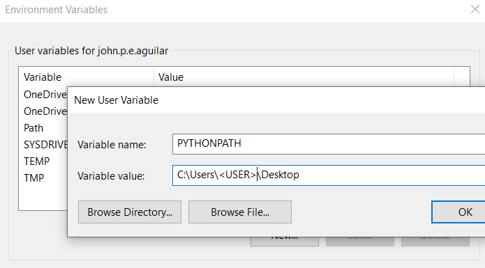

# Import Modules and Exploring Standard Library

https://www.youtube.com/watch?v=CqvZ3vGoGs0&list=PL-osiE80TeTt2d9bfVyTiXJA-UTHn6WwU

## My module

`my_module.py`

```py

print('Imported my module...')

test = 'Test String'

def find_index(to_search, target):
    '''Find the index of a value in a sequence'''
    for i, value in enumerate(to_search):
        if value == target:
            return i

    return -1

```

`intro.py` is in a same path of `my_module.py`

```py

import my_module

courses = ['History', 'Math', 'Physics', 'CompSci']

index = my_module.find_index(courses, 'Math')
print(index)

```

**Test your python**

```bash
python intro.py
```

**OUTPUT**

```bash
Imported my module...
1
```

Aside from the output, it would also generate `__pycache__`.

Check the `.gitignore` and make sure that you have it ignored on `git`

```properties
# Byte-compiled / optimized / DLL files
__pycache__/
```

See [`.gitignore`](./.gitignore) to see more

## Alias import

```py

import my_module as mm

courses = ['History', 'Math', 'Physics', 'CompSci']

index = mm.find_index(courses, 'Math')
print(index)

# => Imported my module...
# => 1
```

### From Import

**Import function without any alias or module name**

```py

from my_module import find_index

courses = ['History', 'Math', 'Physics', 'CompSci']

index = find_index(courses, 'Math')
print(index)

# => Imported my module...
# => 1
```

**NOTE**: This approach will only give access to the `find_index` function and excludes the rest, such as the `test` variable defined in the `my_module.py`

##### So we can **specific multiple imports** from the module:

```py
from my_module import find_index, test

courses = ['History', 'Math', 'Physics', 'CompSci']

index = find_index(courses, 'Math')
print(index)
print(test)

# => Imported my module...
# => 1
# => Test String
```

**You can also specify alias**

```py
from my_module import find_index as fi

courses = ['History', 'Math', 'Physics', 'CompSci']
index = fi(courses, 'Math')

print(index) # => 1
```

#### Frowned upon import

```py
from my_module import *
```

This will import everything inside the `my_module.py` but the disadvantage is, we never know which functions or properties came out from that module.

```py
# * The `my_module` is found by python in the following list of path:
import sys
print(sys.path)
```

```bash
['path\\to\\project\\root\\directory',
'C:\\Users\\<USER>\\AppData\\Local\\Programs\\Python\\Python312\\python312.zip',
'C:\\Users\\<USER>\\AppData\\Local\\Programs\\Python\\Python312\\DLLs',
'C:\\Users\\<USER>\\AppData\\Local\\Programs\\Python\\Python312\\Lib',
'C:\\Users\\<USER>\\AppData\\Local\\Programs\\Python\\Python312',
'C:\\Users\\<USER>\\AppData\\Local\\Programs\\Python\\Python312\\Lib\\site-packages']
```

These is the list where `Python` looks for the imported modules (in order).

##### We can add a `PATH` to the list using the following code:

```py
import sys
sys.path.append('/path/to/your/modules')
```

##### Or set `PATH` in the Environment Variables

###### Mac

`.bash_profile`

```bash
alias python=python3
export PYTHONPATH="/path/to/your/modules"
```

###### Windows

Set in `Environment Variables`



# Standard Library

Few modules in the standard library are listed below:

- `random`
- `math`
- `datetime`
- `calendar`
- `os`

```py
import random

courses = ['History', 'Math', 'Physics', 'CompSci']

print(dir(random))
print(help(random.choice))

random_course = random.choice(courses)

print(random_course, ': The random course picked') # => Physics : The random course picked
```

```py
import datetime
import calendar

print(datetime.date.today()) # => 2024-02-11
print(calendar.isleap(2024)) # => True
```

```py
import os

print(os.getcwd()) # => path/to/current/project/root/directory
print(os.__file__) # => path/to/os.py
```

## Python Joke?

```py
import antigravity
```

Just import is enough and it will open a browser: https://xkcd.com/353/
